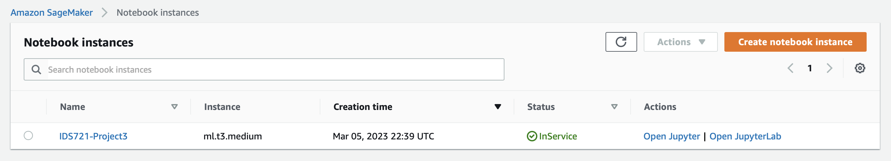
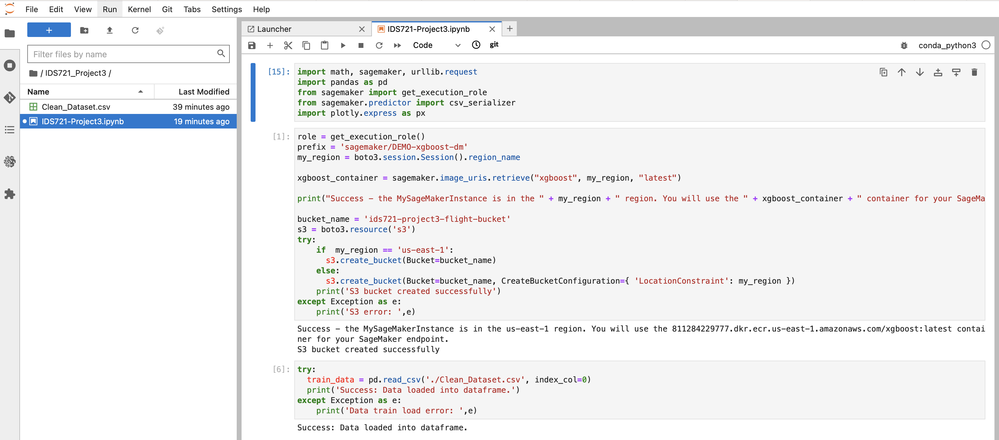
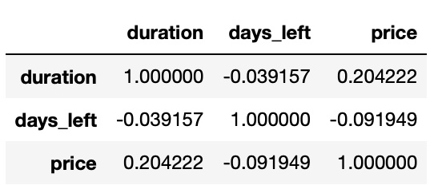
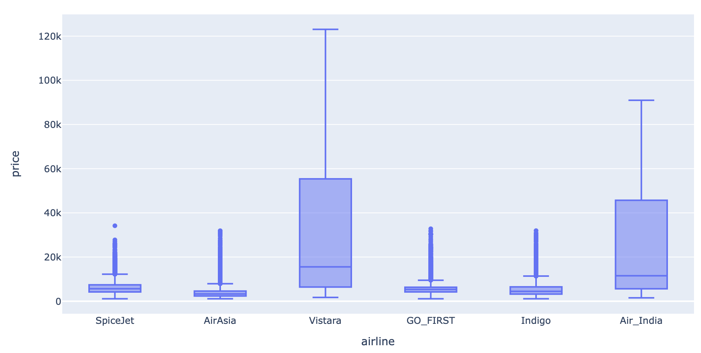
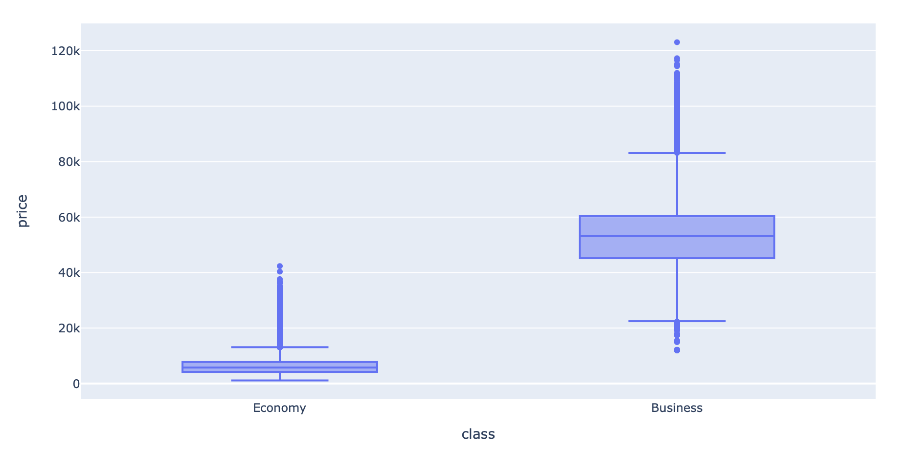

# IDS721 Project 3

### Cloud-based Big Data Systems for Indian Flight Price Analysis

#### About

In this project, flight price in Indian market is analyzed in AWS Sagemaker Cloud-based Big Data Systems.

My AWS Sagemaker instance is showed as above:

It is a ml.t3.medium instance based on Amazon Linux 2, Jupyter Lab 3. 

#### Files

* Python code for data analysis: [IDS721-Project3.ipynb](https://github.com/YuankaiZhu/IDS721_Project3/blob/main/IDS721-Project3.ipynb)

* Data set: [Clean_Dataset.csv](https://github.com/YuankaiZhu/IDS721_Project3/blob/main/Clean_Dataset.csv)

#### What I did up to now

* Import the required libraries and defines the environment variables

* Create the S3 bucket to store my data

*  load the data into a dataframe

* Show numeric data coorelation

  

* Box plot for airline vs price

  

* Box plot for class vs price

  